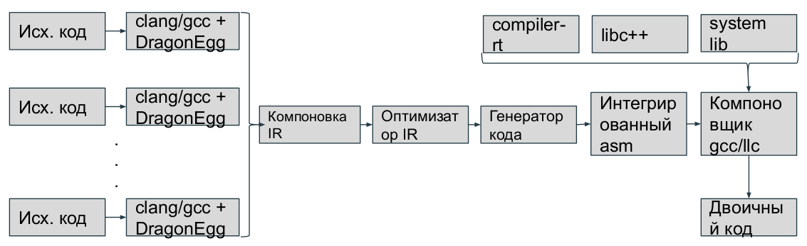

Компиляторы
==============

Установка LLVM
~~~~~~~~~~~~~~~
* Склонировать репозиторий с LLVM:

 :: 

  git clone https://github.com/llvm/llvm-project.git

* Configure and build LLVM and Clang:

 :: 

  cd llvm-project 

  mkdir build

  cd build

  cmake -G <generator> [options] ../llvm

 Generators:

  Ninja — для генерации ninja-build сборочных файлов

  Unix Makefiles — для генерации make поддерживающих parallel makefiles

  Visual Studio — for generating Visual Studio projects and solutions
 
  Xcode — for generating Xcode projects

 Options:

        -DLLVM_ENABLE_PROJECTS = '...' — semicolon-separated list of the LLVM subprojects you’d like to additionally build. Can include any of: clang, clang-tools-extra, libcxx, libcxxabi, libunwind, lldb, compiler-rt, lld, polly, or debuginfo-tests

        *For example* : -DLLVM_ENABLE_PROJECTS="clang;libcxx;libcxxabi"

        -DCMAKE_INSTALL_PREFIX=directory — Specify for directory the full pathname of where you want the LLVM tools and libraries to be installed (default /usr/local)

        -DCMAKE_BUILD_TYPE=type — Valid options for type are Debug, Release, RelWithDebInfo, and MinSizeRel. Default is Debug.

        -DLLVM_ENABLE_ASSERTIONS=On — Compile with assertion checks enabled (default is Yes for Debug builds, No for all other build types)

* Запуск сборки:

 :: 

  cmake --build .
  cmake --build --target install

Примечания:

 #. Собирать на каком-либо теге
 #. Можно выкачивать не весь репозиторий, см. опцию - -depth в гите
 #. При сборке нужно включить проект clang в -DLLVM_ENABLE_PROJECTS
 #. Собирать Debug версию (по умолчанию)
 #. Для сборки мне понадоби лось 8 GB Ram + 50 GB файлов подкачки + 70 GB свободного места
 #. Требуется cmake >= 3.13.4, python >= 2.7, gcc >= 5.1.0, ninja-build

Инструменты и организация
~~~~~~~~~~~~~~~~~~~~~~~~~~

Проект LLVM включает несколько библиотек и инструментов, которые, все вместе, образуют больщую инфраструктуру компилятора. Философия LLVM "все сущее есть библиотека"

*LLVM* - фреймворк со множеством инструментов позволяющий изучать/проходить все стадии компиляции

**10 лет тому назад** реализация, в значительной степени состоящая из алгоритмов трансляции в машинный код, опиралась на GCC, для трансляции программ в промежуточное представление LLVM (IR)

**Сейчас** Собственный codegen. Центральным аспектом LLVM является промежуточное представление IR в форме *Single-Static-Assignments* (SSA), обладающее 2 важными характеристиками:

 #. Код организован в виде трехадресных инструкций
 #. Имеет бесконечное множество регистров

В философии LLVM есть важный аспект, компилятор (clang) не применяет оптимизаций во время компиляции, оставляя возможность выполнения оптимизаций в то время, когда программа не работает (н: во время компоновки)

**Конкуренция с Java**  Для поддержки оптимизации на всем жизненном цикле программы необходимо их распространение в формате LLVM IR, это предполагает работу LLVM как виртуальной машины и конкуренцию с Java

**Но** LLVM IR(внутреннее представление) не является системно-независимой, к тому же в LLVM отсутствует оптимизация с обратной связью

LLVM сегодня
"""""""""""""""
.. figure:: img/structure.png
    :width: 600 px
    :align: center

Части инфраструктуры:

 * **Анализатор исходного кода (frontend "clang"):** Компилятор, выполняющий этап трансляции программ на языках C, C++,.. в промежуточное представление LLVM IR. Включает лексический, синтаксический и семантический анализаторы, а также генератор кода LLVM IR
 * **Промежуточное представление (IR):** Промежуточное представление LLVM IR имеет две формы: удобночитаемую текстовую форму и двоичную
 * **Генератор выполняемого кода (backend "asm, JIT"):** Компилятор, преобразующий промежуточное представление LLVM IR программы в конкретный код на языке ассемблера для заданной архитектуры или в двоичный объектный код.

Все компоненты компилятора взаимодействуют друг с другом 2-мя способами:

 #. **Через структуры в памяти:** Clang использует каждый компонент LLVM как библиотеку и опирается на структуру данных в памяти

 #. **Через файлы:** Пользователь запускает отдельные инструменты и использует их выходные файлы как входные файлы для последующих инструментов 

Используемая литература
-------------------------
`LLVM. Инфраструктура для разработки компиляторов <LLVMbook.pdf>`_