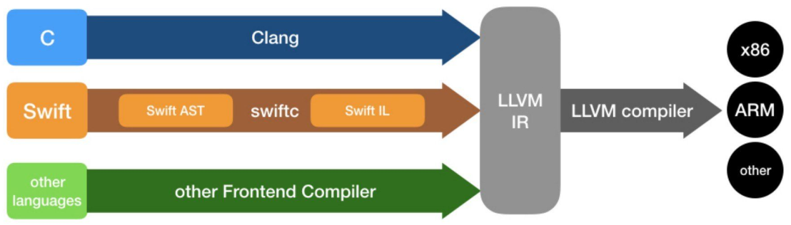
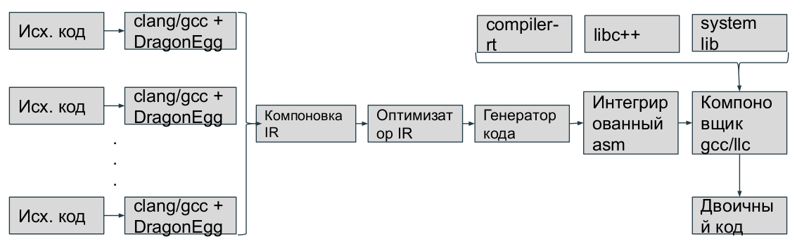
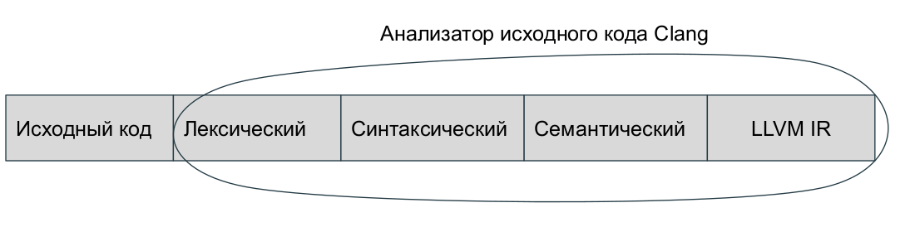
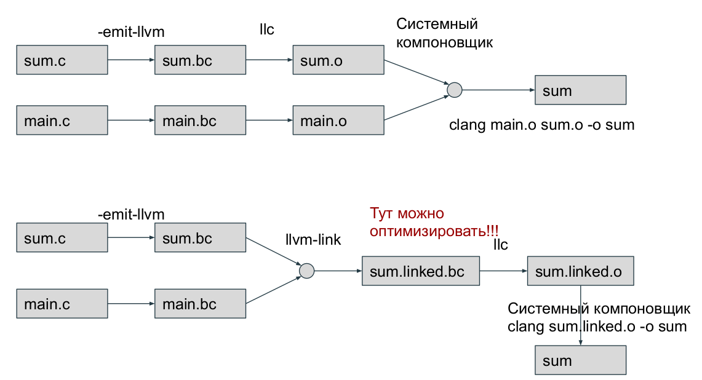

LLVM: инфраструктура для разработки компилятора
==================================================

Установка LLVM
~~~~~~~~~~~~~~~
* Склонировать репозиторий с LLVM:

 :: 

  git clone https://github.com/llvm/llvm-project.git

* Конфигурирование сборочных файлов:

 :: 

  cd llvm-project 

  mkdir build

  cd build

  cmake -G <generator> [options] ../llvm

 Generators:

  Ninja — для генерации ninja-build сборочных файлов

  Unix Makefiles — для генерации make поддерживающих parallel makefiles

  Visual Studio — for generating Visual Studio projects and solutions
 
  Xcode — for generating Xcode projects

 Options:

        -DLLVM_ENABLE_PROJECTS = '...' — semicolon-separated list of the LLVM subprojects you’d like to additionally build. Can include any of: clang, clang-tools-extra, libcxx, libcxxabi, libunwind, lldb, compiler-rt, lld, polly, or debuginfo-tests

        *For example* : -DLLVM_ENABLE_PROJECTS="clang;libcxx;libcxxabi"

        -DCMAKE_INSTALL_PREFIX=directory — Specify for directory the full pathname of where you want the LLVM tools and libraries to be installed (default /usr/local)

        -DCMAKE_BUILD_TYPE=type — Valid options for type are Debug, Release, RelWithDebInfo, and MinSizeRel. Default is Debug.

        -DLLVM_ENABLE_ASSERTIONS=On — Compile with assertion checks enabled (default is Yes for Debug builds, No for all other build types)

* Запуск сборки:

 :: 

  cmake --build .
  cmake --build --target install

Примечания:

 #. Собирать на каком-либо теге
 #. Можно выкачивать не весь репозиторий, см. опцию - -depth в гите
 #. При сборке нужно включить проект clang в -DLLVM_ENABLE_PROJECTS
 #. Собирать Debug версию (по умолчанию)
 #. Для сборки мне понадоби лось 8 GB Ram + 50 GB файлов подкачки + 70 GB свободного места
 #. Требуется cmake >= 3.13.4, python >= 2.7, gcc >= 5.1.0, ninja-build

Инструменты и организация
~~~~~~~~~~~~~~~~~~~~~~~~~~

Проект LLVM включает несколько библиотек и инструментов, которые, все вместе, образуют больщую инфраструктуру компилятора. Философия LLVM "все сущее есть библиотека". Это фреймворк со множеством инструментов позволяющий изучать/проходить все стадии компиляции

**10 лет тому назад** реализация, в значительной степени состоящая из алгоритмов трансляции в машинный код, опиралась на GCC, для трансляции программ в промежуточное представление LLVM (IR)

В философии LLVM есть важный аспект, компилятор (clang) не применяет оптимизаций во время компиляции, оставляя возможность выполнения оптимизаций в то время, когда программа не работает (н: во время компоновки)

**Конкуренция с Java**  Для поддержки оптимизации на всем жизненном цикле программы необходимо их распространение в формате LLVM IR, это предполагает работу LLVM как виртуальной машины и конкуренцию с Java

**Но** LLVM IR(внутреннее представление) не является системно-независимой, к тому же в LLVM отсутствует оптимизация с обратной связью

LLVM сегодня
"""""""""""""""

Части инфраструктуры:

 * **Анализатор исходного кода (frontend "clang"):** Компилятор, выполняющий этап трансляции программ на языках C, C++,.. в промежуточное представление LLVM IR. Включает лексический, синтаксический и семантический анализаторы, а также генератор кода LLVM IR
 * **Промежуточное представление (IR):** Промежуточное представление LLVM IR имеет две формы: удобночитаемую текстовую форму и двоичную
 * **Генератор выполняемого кода (backend "asm, JIT"):** Компилятор, преобразующий промежуточное представление LLVM IR программы в конкретный код на языке ассемблера для заданной архитектуры или в двоичный объектный код.

Все компоненты компилятора взаимодействуют друг с другом 2-мя способами:

 #. **Через структуры в памяти:** Clang использует каждый компонент LLVM как библиотеку и опирается на структуру данных в памяти

 #. **Через файлы:** Пользователь запускает отдельные инструменты и использует их выходные файлы как входные файлы для последующих инструментов

Взаимодействие с драйвером компилятора
""""""""""""""""""""""""""""""""""""""""

Драйвер компилятора можно сравнить с официантом в ресторане, он принимает ваш заказ, передёт его повару и затем приносит готовое блюдо. В LLVM и Clang функции драйвера компилятора выполняет инструмент *clang*

Чтобы увидеть, какие инструменты вызываются драйвером, добавьте команду-аргумент -###

.. code-block:: bash

  clang -### hello.c -o hello
  clang version 3.4 (tags/RELEASE_34/final 211335)
  Target: i386-pc-linux-gui
  Thread model: posix
  “clang” “-cc1” (...parameters) “hello.c” “-o” “/tmp/hello-dddafc1.o”
  “/usr/bin/ld” (...parameters) “/tmp/hello-dddafc1.o” “-o” “hello”

 
* clang -cc1 реализует весь цикл компиляции

Использование автономных инструментов
"""""""""""""""""""""""""""""""""""""""

Тот же самый процесс компиляции, можно выполнить с использованием автономных инструментов LLVM, передавая вывод одного инструмента на ввод другого. Скорость компиляции уменьшится, но появляется возможность тонкой настройки параметров промежуточных инструментов:

 * **opt:** выполняет оптимизацию программы на уровне промежуточного представления IR. На входе файл с биткодом, на выходе файл того же типа  
 * **llc:** выполняет преобразование биткода в исходный текст на языке ассемблера для данной архитектуры. Принимает аргументы, опредеяющие уровень оптимизации
 * **llvm-mc:** выполняет трансляцию ассемблерного кода и может создавать объектные файлы (ELF, Mach, PE). Может также дизассемблировать файлы, приводя ассемблерный код во внутренние конструкции LLVM
 * **lli:** реализует интепретатор и JIT компилятор для IR
 * *llvm-link:* выполняет компоновку нескольких файлов с биткодом в один большой файл с биткодом LLVM
 * **llvm-as:** преобразует файлы с промежуточными представлением IR в текстовом виде (сборки LLVM), в файлы с биткодом LLVM
 * **llvm-dis:** декодирует биткод LLVM в сборки LLVM

Как это работает?
""""""""""""""""""

.. code-block:: c

  // main.c
  #include <stdio.h>

  int sum(int x, int y);

  int main() {
    int r = sum(3, 4);
    printf("r = %d\n",r);
    return 0;
  }

.. code-block:: c

  // sum.c

  int sum(int x, int y) {
    return x+y;
  }

.. code-block:: bash

  # 1. можно скомпилировать все одной командой:
  clang main.c sum.c -o sum 
  
  # 2.1 Тот же результат можно получить с помощью автономных инструментов:
  clang -emit-llvm -c main.c -o main.bc // получение биткод формы
  clang -emit-llvm -c sum.c -o sum.bc   // или
  clang -emit-llvm -S main.c -o main.ll // получение читаемой формы
  clang -emit-llvm -S sum.c -o sum.ll

  # 2.2a Преобразовать биткод в объектные файлы, далее создать исполняемый файл путем компоновки
  llc -filetype=obj main.bc -o main.o
  llc -filetype=obj sum.bc -o main.o
  clang main.o sum.o -o sum

  # 2.2b Сначала скомпоновать файлы с биткодом в 1 файл, затем преобразовать его в объектный файл
  # и из него получить исполняемый файл
  llvm-link main.bc sum.bc -o sum.linked.bc
  llc -filetype=obj sum.linked.bc -o sum.linked.o
  clang sum.linked.o -o sum

Приемы программирования на C++ в LLVM
""""""""""""""""""""""""""""""""""""""""

Библиотеки и инструменты LLVM написаны на языке C++ с использованием преимуществ ООП (Полиморфизма, Наследования, Инкапсуляции), а также шаблонов (template). C полным списком эффективных приемов программирования на C++, используемых в LLVM можно ознакомиться `здесь <http://llvm.org/docs/CodingStandards.html>`_

Демонстрация расширяемого интерфейса проходов
"""""""""""""""""""""""""""""""""""""""""""""""

Под "проходом" в данном случае понимается анализ преобразования или оптимизации. LLVM API позволяет регистрировать собственные проходы на разных этапах компиляции. Регистрация проходов выполняются с помощью диспетчера проходов *PassManager* 

.. code-block:: c

  bool X86PassConfig::addPreEmitPass() {
    if(getOptLevel() != CodeGenOpt::None && getX86Subtarget().hasSSE2()) {
      addPass(createExecutionDependencyFixPass(&X86::VR128RegClass));
    }
    if(getOptLevel() != CodeGenOpt::None &&
      getX86Subtarget().padShortFunctions()) {
      addPass(createX86PadShortFunctions());
    }
  ...
  }

TableGen(.td)
""""""""""""""""""

Инструмент LLVM, используемый системой сборки, что бы сгенерировать программный код с++ для тех частей компилятора, которые могут быть синтезированы механическим способом

.. code-block:: bash

  //DiagnosticRarseKinds.td
  def err_invalid_sign_spec: Error<”’%0’ cannot be signed or unsigned”>;
  def err_invalid_short_spec: Error<”’short %0’ is invalid”>;

.. note::

  Цель TableGen - помочь человеку разрабатывать и поддерживать
  записи информации о предметной области. Поскольку таких
  записей может быть большое количество, он специально
  разработан, чтобы позволить писать гибкие описания и
  вычеркивать общие особенности этих записей. Это уменьшает
  количество дублирования в описании, снижает вероятность
  ошибки и упрощает структурирование информации, относящейся
  к предметной области.
  Основная часть TableGen анализирует файл, создает экземпляры
  объявлений и передает результат на обработку в «бэкэнд
  TableGen», зависящий от домена. В настоящее время основным
  пользователем TableGen является генератор кода LLVM. В случае каких либо вопросов обращайтесь к `документации  <https://releases.llvm.org/9.0.0/docs/TableGen/LangRef.html>`_

Анализатор исходного кода
~~~~~~~~~~~~~~~~~~~~~~~~~~~~~

Подобно названию LLVM, имеющему несколько значений, название Clang также может использоваться в трех разных смыслах:
 
 #. Анализатор исходного кода

 #. Драйвер компилятора

 #. Фактический компилятор (clang -cc1)
 
Инструмент clang -cc1 имеет специальный параметр для вывода абстрактного синтаксического дерева (AST)

.. code-block:: bash

  clang -Xclang -ast-dump hello.c
  # или
  clang -сс1 -ast-dump hello.c

Библиотеки libclang:

 * **linclangLex**: используется для предварительной обработки и лексического анализа
 * **libclangAST**: содержит функции для построения и управления абстрактных синтаксических деревьев
 * **libclangParse**: используется для парсинга результатов фазы лексического анализа
 * **libclangSema**: используется для семантического анализа
 * **libclangCodeGen**: генерирует код промежуточного представления LLVM IR с использованием информации о целевой архитектуре
 * **libclangAnalysis**: содержит ресурсы для статического анализа
 * **libclangRewrite**: содержит инфраструктуру для реализации инструментов рефакторинга кода
 * **libclangBasic**: содержит множество утилит - абстракции управлния памятью, поиск источников данных и диагностика

Лексический анализ
""""""""""""""""""""

На самом первом этапе анализатор исходного кода разбивает языковые конструкции в текстовом формате на множество слов и лексем, удаляя такие элементы программы, как комментарии, пробелы и табуляции. Каждое слово должно принадлежать подможеству языка, а каждое зарезервированное слово преобразуется во внутреннее представление компилятора. Зарезервированные слова определены в файле *include/clang/Basic/TokenKinds.def* (Определения помещаются в пространство имён tok.т.е доступ к ним можно получить например: **tok::l_brace** и тд)

.. code-block:: c

  // C99 6.4.2: Identifiers.
  TOK(identifier) // abcde123
  // C++11 String Literals.
  TOK(utf32_string_literal)// U"foo"

  PUNCTUATOR(r_paren,")")
  PUNCTUATOR(l_brace,"{")
  PUNCTUATOR(less, "<")
  KEYWORD(while, KEYALL)

Инструменты Clang и фреймворк LibToling
~~~~~~~~~~~~~~~~~~~~~~~~~~~~~~~~~~~~~~~~~

Инструменты Clang опираются на фреймворк LibToling, библиотеку Clang, которая может служить основой для создания автономных интсрументов

Инструменты на базе libTooling:

 * Clang Tidy
 * Clang Modernizer
 * Clang Apply Replacements
 * ClangFormat
 * Modularize
 * PPTrace
 * Clang Query

Clang-tidy
""""""""""""""""""

Данный инструмент проверяет наличие в исходном коде распространенных нарушений
стандартов оформления в том числе. Инструмент просматривает дерево AST и действует намного быстрее. В отличие от средств проверки в составе статического анализатора Clang, проверки написанные для clang-tidy, обычно нацелены на определения соответствия или несоответствия определенным соглашениям по оформлению исходного кода:

 * Переносимость кода между разными компиляторами;
 * Следование определенным идиомам;
 * Возможность появления ошибок из-за злоупотребления опасными особенностями языка

Проверка исходного кода с помощью Clang-tidy:

.. code-block:: bash

  clang-tidy [параметры] [<файл0>..<файлN>] [--команды компилятора]
  # можно воспользоваться * в параметре -checks для запуска множества проверок
  clang-tidy -checks="llvm-*" file.cpp

Так как наш код компилируется вместе с Clang, нам потребуется база данных команды компиляции. Поэтому начнем с её создания. Перейдите в каталог, где находятся исходные тексты LLVM, и создайте отдельный каталог для хранения файлов CMake

.. code-block:: bash

  mkdir cmake-scripts
  cd cmake-scripts
  cmake -DCMAKE_EXPORT_COMPILE_COMMANDS=ON ../llvm

.. tip::
  Если вы столкнетесь с ошибкой, сообщающей о неизвестном исходном файле и          ссылающейся на файл с реализацией нашего средства проверки, созданный в прерыдущей главе, просто добавьте имя этого файла в *CMakeLists.txt*. Для этого выполните следующую команду и запустите CMake еще раз

.. code-block:: bash

    vim ../llvm/tools/clang/lib/StaticAnalyzer/Checkers/CMakeLists.txt

Затем в корневом каталоге LLVM создайте ссылку на файл базы данных команд компиляции

.. code-block:: bash

  ln -s $(pwd)/compile_commands.json ../llvm
  # Теперь можно вызвать сам инструмент
  cd ../llvm/tools/clang/lib/StaticAnalyzer/Checkers
  clang-tidy -checks="llvm-*" ReactorChecker.cpp

Пример по использованию clang-tidy:

.. code-block:: bash

  clang-tidy test.cpp --fix-errors --fix
  -checks=bugprone-*,cppcoreguidelines-*,misc-*,modernize-*,performance-*,readability-* --

Было:

.. code-block:: bash

  #include <stdio.h>
  int main() {
    int i;
    printf (“%d”, i);
  }

Стало:

.. code-block:: c

  #include <cstdio>
  auto main() -> int {
    int i = 0;
    printf ("%d", i);
  }

Clang Modernizer
"""""""""""""""""""
  
**Clang Modernizer** = это революционный инструмент, цель которого помочь польщователям адаптировать старый код на С++ под новейшие стандарты:

 * **преобразование циклов:** циклы в старом С for (;;), преобразуются в более новые циклы вида: for (auto &...:..)
 * **преобразование пустых указателей:** константы NULL и 0, используемые для представления пустых указателей, замещаются nullptr (C++11)
 * **преобразование с добавлением ключевого слова auto:** в некоторые объявляения включается ключевое слово *auto* для повышения читаемости кода
 *  **преобразование с добавлением ключевого слова override:** добавляет в объявление методов, переопределяющих виртуальные методы родительских классов, спецификатор override
 * **преобразование передачи аргументов по значению:** передача константных ссылок замещается передачей по значени с выполнением операции копирования
 * **преобразование с заменой auto_ptr:** замещает старые автоматические указатели std::auto_ptr на std::unique_ptr

Пример по использованию clang-modernizer:

.. code-block:: bash

  clang-modernize [параметры] <файл0> [... <файлN>] [--<команда компилятора>]

Clang Apply Replacements 
""""""""""""""""""""""""""""

Данный интструмент отвечает за чтение файлов с поправками (Clang Modernize), отсеивает протиречивые и повторяющиеся поправки, и применяет их к файлам с исходными текстами.

Пример запуска:

* Чтобы опробовать Clang Apply Replacements нам нужно сначало воспользоваться Clang Modernizer и сохранить его поправки в файл

.. code-block:: c++

  int main() {
    const int size = 5;
    int arr[] = {1,2,3,4,5};
    for (int i = 0; i < size; ++i) {
      arr[i] += 5;
    }
    return 0;
  }

* Согласно руководству к Clang-Modernize, этот цикл можно безопасно преобразовать в цикл с помощью auto. Для этого следует выполнить:

.. code-block:: bash

  clang-modernize -loop-convert -serialize-replacements test.cpp --serialize-dir=./

* Чтобы применить исправления, надо выполнить команду:

.. code-block:: bash

  clang-apply-replacements

ClangFormat
"""""""""""""

Реализация форматирования кода в соответствии с соглашениями Инструмент, позволяющий разбить код на 80-символьные строки и улучшить его удобочитаемость.

Пример запуска:

.. code-block:: c++

  // test.cpp
  #include <cstdio>
  int main() {int i = 0;printf("%d", i);printf("%d", i);printf("%d",
  i);printf("%d", i);printf("%d", i);printf("%d", i);printf("%d",
  i);printf("%d", i); return 0;}

* Запускаем команду:

.. code-block:: bash
  
  # clang-format -style=LLVM -dump-config > .clang-format
  clang-format --style-LLVM test.cpp

* Результат: 

.. code-block:: c++

  #include <cstdio>
  int main() {
  int i = 0;
  printf("%d", i);
  printf("%d", i);
  printf("%d", i);
  printf("%d", i);
  printf("%d", i);
  printf("%d", i);
  printf("%d", i);
  printf("%d", i);
  return 0;
  }

Modularize
"""""""""""""

Целью этого инструмента является оказание помощи в решении задачи внедрения модулей. Он анализирует множество заголовочных файлов и сообщает, если обнаруживает повторяющиеся определения переменных, макросов или определения макросов, которые могут приводить к разным результатам

Пример запуска: 

* Создадим файл list.txt:

.. code-block:: bash

  gamelogic.h
  screenlogic.h

* Теперь достаточно запустить modularize и передвать ему файл:

.. code-block:: bash

  modularize list.txt

* Если изменить один из заголовочных файлов, включив в него символы из другого заголовочного файла, modularize сообщит, что проект опирается на небезопасное для модулей поведение, и что следует исправить проблему перед повторной попыткой создать файл module.modulemap

Module Map Checker
"""""""""""""""""""""

Инструмент исследует файл module.modulemap, проверяя - охватывае ли он все заголовочные файлы в каталоге

* Пример запуска:

.. code-block:: bash

  module-map-checker module.modulemap

PPTrace
""""""""""
.. epigraph::

 "Танцует в тесном контакте с лекическим аназизатором, чтобы обеспечивать эффективнуб предварительную обработку лексем"

Вывод трассировочной информации о работе препроцессора. Достигается это за счет реализации функций обратного вызова в интерфейсе clang::PPCallbacks
 
Он начинает с регистрации самого себя в роли «наблюдателя» за препроцессором и затем запускает анализ файлов. Информация о всех действиях препроцессора, таких как интерпретация директивы #if, импортирование модуля, подключение заголовочного файла и многих других, выводится на экран

Пример запуска:

.. code-block:: c++

  // hello.cpp
  #if 0
  #include
  #endif
  #ifdef CAPITALIZE
  #define WORLD "WORLD"
  #else
  #define WORLD "world"
  #endif
  extern int write(int, const char*,
  unsigned long);
  int main() {
    write(1, "Hello, ", 7);
    write(1, WORLD, 5);
    write(1, "!\n", 2);
    return 0;
  }

* Запускаем инструмент:

.. code-block:: bash

  pp-trace hello.c

* В результате возникает серия событий препроцессора, касающихся определния макросов, еще до того, как начнется фактическая обработка исходного файла:

.. code-block:: bash

  -Callback: if
   Loc: "hello.c:1:2"
   ConditionRange: [:"hello.c:1:4", "hello.c:2:1"]
   CondiotionValue: CVK_False
   ..

Clang-Query
"""""""""""""

Дает возможность исследовать дерево AST программы и отыскивать его сегменты по заданным условиям. Читает исходные файлы и интерактивно запрашивать узлы дерева AST. Выявляет узлы AST, соответствующие заданным условиям. Список доступных предикатов можно найти в заголовочном файле ASTMatchers.h.
Предполагает наличие базы данных команд компиляции.

Пример запуска:

.. code-block:: bash

  clang-query hello.c --

* После запука, инструмент выведет интерактивное приглашение к вводу, ожидая команд. Теперь можно вести команду match и имя предиката. Например, следующая команда требует от clang-query вывести все узлы типа CallExpr:

.. code-block:: bash

  clang-query> match callExpr()

  Match #1
  hello.c:12:5: note: "root" node binds here
    write(1, "Hello, ", 7);
    ^~~~~~~~~~~~~~~~~~~~~~~

Cписок команд:

* help: выводит список доступных команд;
* match <имя предиката> или m <имя предиката>: выполняет обход дерева AST и выполняет поиск узлов, соответствующих указанному предикату;
* set output <(diag | print | dump)>: определяет, как будет выводиться информация о найденных узлах
   * Параметр diag (действует по умолчанию) обеспечивает вывод диагностических сообщений для найденных узлов.
   * Параметр print обеспечивает простой вывод соответствующего фрагмента исходного кода.
   * Параметр dump обеспечивает вызов метода dump(),который дополнительно выводит все дочерние узлы

Clang-Check
""""""""""""""""

Clang-Check позволяет выполнять парсинг исходного кода на C/C++ и выводить дерево AST или выполнять простые проверки. Он также может применять «исправления», предлагаемые Clang, используя инфраструктуру, построенную на основе Clang Modernizer

Чтобы получить дерево AST для файла:

.. code-block:: bash

  clang-check <Имя_файла> -ast-dump -- 

Удаление вызовов c_str() "Самый маленький инструмент для рефакторинга"
""""""""""""""""""""""""""""""""""""""""""""""""""""""""""""""""""""""""

Инструмент *remove-cstr-calls*  - это просто пример инструмента преобразование исходных текстов, то есть, инструмента рефакторинга. Он ищет избыточные вызовы метода c_str() обьектов str::string и удаляет их.

Такие вызовы считаются избыточными когда:

* когда новый объект string создается с вызовом метода c_str() другого объекта string. Например **std::string(myString.c_str())**. Эту операцию можно упростить за счет использования конструктора копии: **std::string(myString)**
* когда на основе объектов string создаются новые экземпляры классов LLVM StringRef и Twine. В этих случаях предпочтительнее использовать сам обьект string, а не результат вызова c_str(), то есть: **StringRef(myString)** вместо **StringRef(myString).c_str()**

Создание собственного инструмента
~~~~~~~~~~~~~~~~~~~~~~~~~~~~~~~~~~~~

Проект Clang предоставляет 3 интерфейса для доступа к функциональным возможностям Clang:

* **libclang:** является основным интерфейсом к механизмам Clang. Поддерживает обратную совместимость, обеспечивая работоспособность существующего ПО после выхода новой версии *libclang*
* **Clang Plugins:** позволяет добавлять свои проходы непосредственно в процедуру компиляции
* **LibTooling** позволяет создавать самостоятельные инструменты, предназначенные для выполнения рефакторинга кода или проверки синтаксиса. В отличии от libclang менее надежен с точки зрения поддержки обратной совместимости, но зато дает полный доступ к структуре дерева AST

Пример создание инструмента:

#. Найдите каталог *llvm-project/clang-tools-extra/*. Там лежит *tool-template*. В нём Cmake и код. Для написания собственного инструмента достаточно написать код на cpp и изменить имя в Cmake. Tool должен лежать тоже в этом каталоге

#. Назовем наш инструмент *cxxgrep*, он будет способен различать конструкции языка *C++*. Пример опций:

.. code-block:: bash

 -function  # Filter by functions
 -i         # Make the search case-insensitive
 -member    # Filter by members
 -parameter # Filter by function parameter
 -record    # Filter by records (class/struct)
 -variable  # Filter by variables

Используемая литература
~~~~~~~~~~~~~~~~~~~~~~~~~~~

`LLVM. Инфраструктура для разработки компиляторов <LLVMbook.pdf>`_