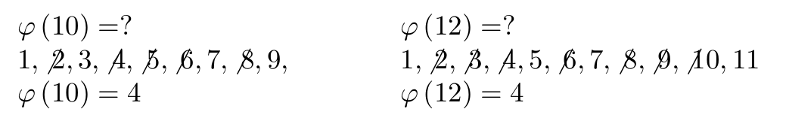

Криптографические методы защиты информации
============================================

Глава 2. Криптосистемы с открытым ключом
----------------------------------------

2.1 Возведение в степень по модулю
"""""""""""""""""""""""""""""""""""

Односторонняя функция (англ. one-way function, OWF) -   математическая функция, которая легко вычисляется для любого входного значения, но трудно найти аргумент по заданному значению функции. В криптографических задачах в качестве односторонней функции часто используется функция:

.. math::
   \\{ y = a^{x}mod p }

Обратная функция называется дискретным логарифмом и является трудновычислимой:

.. math::
   \\{ x = log_a(x)mod p }

.. figure:: img/2.1.png
    :width: 650 px
    :align: center
    :alt: table



Элементы теории чисел
""""""""""""""""""""""

* Число называется простым, если оно не делится ни на какое другое число, кроме самого себя и единицы (11, 23)
* Любое целое положительное число  может быть представлено в виде произведения простых чисел, причем единственным образом (27 = 3*3 * 3,33)
* Два числа называются взаимно простыми если они не имеют ни одного общего делителя кроме единицы (27 и 28) 
* **Функция Эйлера**. Пусть дано целое число N >= 1. Значение функции Эйлера ф(N) равно количеству чисел в ряду 1,2,3,...,N - 1, взаимно простых с N


 #. Если p-простое число, то ф(p) = p-1

 #. Если p и q - два различных простых числа ( p != q). Тогда  ф(pq) = (p-1)(q-1)

* **Теорема Ферма**. Пусть p - простое число и 0 < a < p. Тогда

.. math::
   \\{ a^{p-1} mod p = 1 }

* **Теорема Эйлера**. Пусть a и b - взаимно простые числа. Тогда 

.. math::
   \\{ a^{\varphi(b)} mod b = 1 }

2.2 Алгоритм Эвклида
"""""""""""""""""""""
Пусть a и b — два целых положительных числа. Наибольший общий делитель чисел a и b есть наибольшее число c, которое делит и a и b :

  .. math::
   \\{ c = gcd(a, b) }

.. figure:: img/gcd.png
    :width: 600 px
    :align: center
    :alt: gcd

Пусть a и b — два целых положительных числа. Тогда существуют целые (не обязательно положительные) числа x и y , такие, что

  .. math::
   \\{ ax + by = gcd(a, b) }

Введем три строки U = (u 1 , u 2 , u 3 ), V = (v 1 , v 2 , v 3 ) и T = (t 1 , t 2 , t 3 ). Тогда алгоритм записывается следующим образом:

.. figure:: img/Euclid.png
    :width: 600 px
    :align: center
    :alt: Euclid

2.3 Система Диффи-Хеллмана
"""""""""""""""""""""""""""
Для обеспечения высокой стойкости рассмотренной системы число p-1 должно обязательно содержать большой простой множитесь. Рекомендуют использовать следующее:

  .. math::
   \\{ P = 2Q + 1 ,}

 где Q-простое число

Для Q должны выполняться условия:

  .. math::
   \\{ 1 < G < P − 1  \quad и \quad G^{Q} mod P \quad != 1 }

Согласно малой теореме Ферма можно утверждать,что если для какого-то числа a < P выполняется условие **a^(P-1)mod P != 1** ,  то число  является составным. Исходя из данного утверждения, можно легко разработать тест Ферма для проверки на простоту: :: 

 bool testFerma(long long p, int k) {
  if(p==2) return true;
  if(p&1)  return false;
  for(int i=0; i<k; ++i) {
    long long a=rand()%(P-1)+1;
    if(gcd(a,p)!=1 || powMod(a,p-1,p)!=1)
      return false;
  }
  return true;
 }

2.4 Метод "шаг младенца, шаг великана"
""""""""""""""""""""""""""""""""""""""""

Задача поиска x, при известных a и y. Сначала берем два целых числа m и k, такие что

  .. math::
   \\{ m * k > p, \quad m = k = \sqrt{p} + 1 }

Вычислим два ряда чисел:

  .. math::
   \\{ y,ay,a^{2y},...a^{m-1}y \quad (mod p) }
   \\{   a^{m},a^{2m},...a^{km} \quad (mod p) }

  (все вычисления по модулю p)

Найдем такие i и j, для которых выполняется равенство

  .. math::
   \\{ a^{im} = a^{i} * y }
   

Число x:

  .. math::
   \\{ x = i * m - j }

