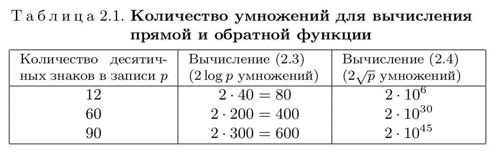
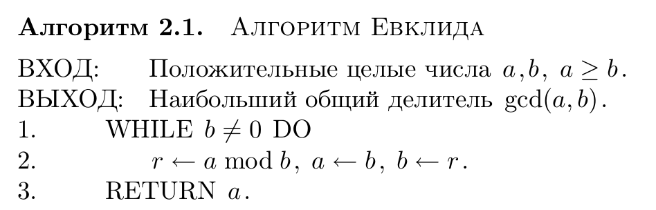
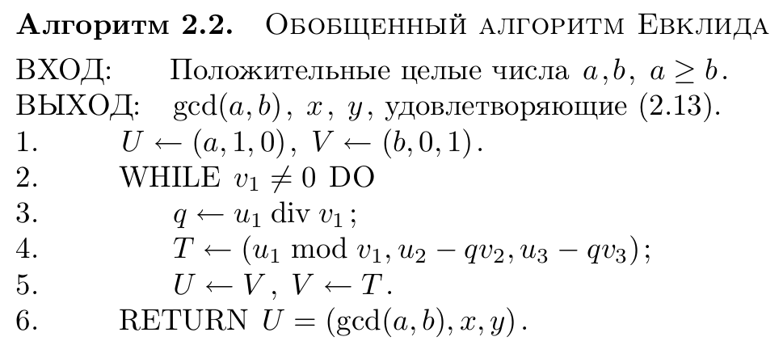
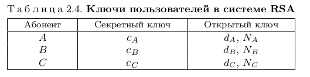

Криптографические методы защиты информации
============================================

Глава 1. Криптосистемы с открытым ключом
~~~~~~~~~~~~~~~~~~~~~~~~~~~~~~~~~~~~~~~~~~

Быстрое возведение в степень по модулю
"""""""""""""""""""""""""""""""""""""""

Односторонняя функция (англ. one-way function, OWF) -   математическая функция, которая легко вычисляется для любого входного значения, но трудно найти аргумент по заданному значению функции. В криптографических задачах в качестве односторонней функции часто используется функция:

.. math::
   { y = a^{x}\bmod p }

Обратная функция называется дискретным логарифмом и является трудновычислимой:

.. math::
   { x = log_a(y)\bmod p }

Перейдем к описанию алгоритма быстрого возведения числа в степень по модулю. Любое десятичное число может быть представлено в виде полинома степеней двойки

.. math::
  x = x_02^{0} + x_12^{1}+ ...+x_t2^{t}

Описание хода вычислений алгоритма:

.. math:: 
  a^{x} \bmod m = y \\
  23^{15} \bmod 17 = ? 

.. math::
 15_{10} = 1111_2 = 2^{0}+2^{1}+2^{2}+2^{3} => \quad 23^{15} = 23^{2^{0}+2^{1}+2^{2}+2^{3}} \\
.. math::
 (23^{2^{0}} * 23^{2^{1}} * 23^{2^{2}} * 23^{2^{3}}) \bmod 17 = y  \\
.. math::
 (23^{2^{0}} \bmod 17 * 23^{2^{1}} \bmod 17 * 23^{2^{2}} \bmod 17 * 23^{2^{3}} \bmod 17) \bmod 17 = y \\
.. math::
 1) 23^{2^{0}} \bmod 17 &= 6 \quad 23^{2^{1}} = 23^{2^{0}} * 23^{2^{0}} \\
.. math::
 2) 23^{2^{1}} \bmod 17 = ((23^{2^{0}} \bmod 17 )*(23^{2^{0}} \bmod 17)) \bmod 17 &= (6 * 6) \bmod 17 = 36 \bmod 17 = 2 \\
.. math::
 3) 23^{2^{2}} \bmod 17 = ((23^{2^{1}} \bmod 17 )*(23^{2^{1}} \bmod 17)) \bmod 17 &= (2*2) \bmod 17 = 4 \\
.. math::
 4)23^{2^{3}} \bmod 17 = ((23^{2^{2}} \bmod 17 )*(23^{2^{2}} \bmod 17)) \bmod 17 &= (4*4) \bmod 17 = 16 \\
.. math::
  Ответ: 23^{15} \bmod 17 = (6*2*4*16) \bmod 17 = 3 \\

Листинг программы:

.. code-block :: java

  public static long calculate( long a, long x, long p ) {
      long y = 1;
      int t = 0;
      if(a < 0 || x < 0 || p <= 0) {
          System.out.println("Negative numbers and p=0 are not supported");
          return -2;
      } else if (p == 1) {
          return 0;
      } else {
          while(x != 0) {
              if ((x&1) == 1) {
                  y = (y * a)%p;
                  t++;
              }
              a = (a * a) % p;
              x >>= 1;
          }
  //            System.out.println("\nNumber of Iteration = "+t);
          return y;
      }
  }
 

.. note::
  Количество операций умножения при вычислении по описанному методу не превосходит *2log x*

.. attention::
  **Доказательство**: Для вычисления чисел ряда требуется t умножений,     для вычисления y не более, чем t умножений. Из условия *t = [log x]* , учитывая,   что *log x ≤ log x*, делаем вывод о справедливости доказываемого утверждения

Элементы теории чисел
""""""""""""""""""""""""""

* Число называется простым, если оно не делится ни на какое другое число, кроме самого себя и единицы (11, 23)
* Любое целое положительное число  может быть представлено в виде произведения простых чисел, причем единственным образом (27 = 3*3 * 3,33)
* Два числа называются взаимно простыми если они не имеют ни одного общего делителя кроме единицы (27 и 28)
* **Функция Эйлера**. Пусть дано целое число N >= 1. Значение функции Эйлера ф(N) равно количеству чисел в ряду 1,2,3, ... ,N - 1, взаимно простых с N

 .. figure:: img/2.2.png
    :width: 600 px
    :align: center
    :alt: phi

 * Если p-простое число, то :math:`\quad \varphi(p) = p - 1 \\` 

 * Если p и q - два различных простых числа ( p != q). Тогда

.. math::
  { \varphi(pq) = (p-1)(q-1)}

* **Теорема Ферма**. Пусть p - простое число и 0 < a < p. Тогда

.. math::
   { a^{p-1}\bmod p = 1 }

* **Теорема Эйлера**. Пусть a и b - взаимно простые числа. Тогда 

.. math::
   { a^{\varphi(b)}\bmod b = 1 }

Обобщенный алгоритм Эвклида
""""""""""""""""""""""""""""""

Пусть a и b — два целых положительных числа. Наибольший общий делитель чисел a и b есть наибольшее число c, которое делит и a и b :

  .. math::
   { c = gcd(a, b) }

Пусть a и b — два целых положительных числа. Тогда существуют целые (не обязательно положительные) числа x и y , такие, что

  .. math::
   { ax + by = gcd(a, b) }

Введем три строки :math:`U = (u_1 , u_2 , u_3 ), V = (v_1 , v_2 , v_3 ), T = (t_1 , t_2 , t_3 )`. Тогда алгоритм записывается следующим образом:

Описание хода вычислений алгоритма:

.. math::
  Euclid(17, 9) \\
.. math::
  ax + by = gcd(a,b) \\
.. math::
  U(a, 1, 0) \quad  V(b, 0, 1) \\
.. math::
  1) q = U1 \ div \  V1 = 1\\
.. math::
    T = (U1 \bmod V1; U2 - qV2; U3 - qV3 ) \\
.. math::
    T = (8, 1, -1) \\
.. math::
    U = V, V = T \\
.. math::
    U = (9,0,1) \\
.. math::
    V = (8,1,-1) \\
.. math::
  2)q = 1 \\
.. math::
    T = (1, -1, 2) \\
.. math::
    U = (8,1,-1) \\
.. math::
    V = (1,-1,2) \\
.. math::
  3)q = 8 \\
.. math::
    T = (0, -9,-17) \\
.. math::
    U = (1,-1,2) \\
.. math::
    V = (0,9,-17) \\\\
.. math::
  Когда \ V1 = 0, тогда \ в \ U \ лежат \ ответы \\
.. math::
  gcd(a,b) = 1, \ x = -1, \ y = 2 \\
.. math::
  17*(-1) + 9*2 = 1 \\
.. math::
  -17+18 = 1 \\
.. math::
  1 = 1 \\

Листинг программы:

.. code-block:: java

  public static long[] calculate(long a, long b) {
      if (a < b) {
          long temp;
          temp = a;
          a = b;
          b = temp;
      }
      long[] U = new long[]{a, 1, 0};
      long[] V = new long[]{b, 0, 1};
      long[] T = new long[3];
      long q;
      while (V[0] != 0) {
          q = U[0]/V[0];
          T[0] = U[0] % V[0];
          T[1] = U[1] - q * V[1];
          T[2] = U[2] - q * V[2];
          for (int i = 0; i < 3; i++) {
              U[i] = V[i];
              V[i] = T[i];
          }
      }
      return U;
  }
 

Система Диффи-Хеллмана
""""""""""""""""""""""""""

Эта криптосистема была открыта в середине 70-х годов американскими учеными Диффи (Whitfield Diffie) и Хеллманом (Martin Hellman) и привела к настоящей революции в криптографии и ее практических применениях. Для обеспечения высокой стойкости рассмотренной системы число p-1 должно обязательно содержать большой простой множитель. Рекомендуют использовать следующее:

  .. math::
   P = 2Q + 1 , \ где \ Q - простое \ число

Для Q должны выполняться условия:

  .. math::
   { 1 < G < P − 1  \quad и \quad G^{Q}\bmod P != 1 }

Согласно малой теореме Ферма можно утверждать,что если для какого-то числа a < P выполняется условие :math:`a^{P-1} \bmod P != 1` ,  то число  является составным. Исходя из данного утверждения, можно легко разработать тест Ферма для проверки на простоту: :: 

 bool testFerma(long long p, int k) {
  if(p==2) return true;
  if(p&1)  return false;
  for(int i=0; i<k; ++i) {
    long long a=rand()%(P-1)+1;
    if(gcd(a,p)!=1 || powMod(a,p-1,p)!=1)
      return false;
  }
  return true;
 }

Абоненты выбирают большие числа Xa, Xb, Xc, которые храняться в секрете. Каждый абонент вычисляет соответсвующее число Y, которое открыто передается другим абонентам

.. math::
   \begin {cases} {Y_A = g^{X_A} \bmod p} \\
      {Y_B = g^{X_B} \bmod p} \\
      {Y_C = g^{X_C} \bmod p} \\
     \end {cases}

Допустим, абонент A решил организовать сеанс связи с B, при этом обоим абонентам доступна открытая информация (P, G, Y). Абонент A сообщает B по открытому каналу, что он хочет передать ему сообщение. Затем абонент A вычисляет величину:

.. math:: 
  {Z_{AB} = (Y_B)^{X_A} \bmod p}

В свою очередь, абонент B вычисляет число:

.. math:: 
  {Z_{BA} = (Y_A)^{X_B} \bmod p}

Получаем что:

.. math:: 
  {Z_{BA} = Z_{AB} }

Доказательство:

.. math:: 
  {Z_{AB} = (Y_B)^{X_A} \bmod p = (g^{X_B})^{X_A} \bmod p = \\
      = g^{X_A X_B} \bmod p = (Y_A)^{X_B} \bmod p = Z_{BA} }

Пример:
  Пусть P = 23 = 2 · 11 + 1 (Q = 11). Выберем параметр G. Попробуем взять g = 3. Проверим: 3^11 mod 23 = 1 и значит, такое g не подходит. Возьмем g = 5. Проверим: 5^11 mod 23 = 22. Итак, мы выбрали параметры p = 23, g = 5. Теперь каждый абонент выбирает секретное число и вычисляет соответствующее ему открытое число. Пусть выбраны Xa = 7 , Xb = 13 . Вычисляем Ya = 5^7 mod 23 = 17, Yb = 5^13 mod 23 = 21. Пусть A и B решили сформировать общий секретный ключ. Для этого A вычисляет Zab = 21^7 mod 23 = 10, а B вычисляет Zba = 17^13 mod 23 = 10.Теперь они имеют общий ключ 10, который не передавался по каналу связи

Листинг программы:

.. code-block:: java

  // Diffie-Hellman.java
  public void generateParameters(){  
          SecureRandom srand = new SecureRandom();
          srand.setSeed(System.currentTimeMillis());
          long Q;
          do {
              Q = srand.nextInt(MAX_VALUE-3)+2;
              P = 2*(int)Q +1;
          } while(!isPrime(Q) || !isPrime(P) || !testFerma(P,100));
  
          do {
              G = srand.nextInt(P-3)+2;// 1 < q < p -1
          } while(ModularExponentiation.calculate(G,Q,P) == 1 );
  
          System.out.println("P = "+P+" G = "+G+" Q = "+Q);
      }
  // Abonent.java
  public class Abonent {
      DiffieHellman diffieHellman;
      private long secretKey;
      private long publicKey;
  
      public Abonent(DiffieHellman diffieHellman) {
          this.diffieHellman = diffieHellman;
          SecureRandom srand = new SecureRandom();
          srand.setSeed(System.currentTimeMillis());
          secretKey = srand.nextInt(diffieHellman.getP()-2)+1;
          publicKey = ModularExponentiation.calculate(diffieHellman.getG(),secretKey, diffieHellman.getP());
      }
      public long calculateZ(long publicSecondAbonentKey) {
          return ModularExponentiation.calculate(publicSecondAbonentKey, secretKey, diffieHellman.getP());
      }

  }

Шифр Шамира
"""""""""""""""

Этот шифр, предложенный Шамиром (Adi Shamir), был первым, позволяющим организовать обмен секретными сообщениями по открытой линии связи для лиц, которые не имеют никаких защищенных каналов и секретных ключей и, возможно, никогда не видели друг друга.

Пусть есть два абонента A и B, соединенные линией связи. A хочет передать сообщение m абоненту B так, чтобы никто не узнал его содержание. A выбирает случайное большое простое число P и открыто передает его B. Затем A выбирает два числа Ca и Da , такие, что

.. math::
  { C_A*D_A \bmod (P-1) = 1  \\
      C_B*D_B \bmod (P-1) = 1 }  

Вычисляем C и D, используя обобщенный алгоритм Эвклида

.. math::
  Вычисляем \ y: \ ax + by = gcd(a, b) ,\ где \ C \ рандомное \ число \\
.. math::
      если \ gcd(С, P-1) \ = \ 1, \ то \\
.. math::
      D = y + (P - 1)

Листинг программы вычисляющей C и D:

.. code-block:: java

 public class Shamir {
    private final long P;
    private long C;
    private long D;

    public static long generatePublicP() {
        SecureRandom srand = new SecureRandom();
        srand.setSeed(System.currentTimeMillis());
        long P;
        do {
            P = srand.nextInt(MAX_VALUE-3)+2;
        } while(!DiffieHellman.isPrime(P) || !DiffieHellman.testFerma(P,100));
        return P;
    }

    public Shamir(long P) {
        this.P = P;
        SecureRandom srand = new SecureRandom();
        srand.setSeed(System.currentTimeMillis());
        long[] EuclidResult;
        do {
            do {
                this.C = srand.nextInt(MAX_VALUE-3)+2;
                EuclidResult = Euclid.calculate(C,P-1);
            } while(EuclidResult[0] != 1);
            this.D = EuclidResult[2] + (P-1);
        } while(C*D%(P-1) != 1 );
    }
  }
  
После этого A передает свое сообщение m. Если m < P, то сообщение передается сразу, если же m >= P, то сообщение разбивается на части. Рассмотрим случай m < P
**Шаг 1.** A вычисляет число

.. math::
  {x_1 = m^{C_A} \bmod p, }

**Шаг 2.** B получив x1, вычисляет

.. math::
  {x_2 = x_1^{C_B} \bmod p, }

**Шаг 3.** A вычисляет число

.. math::
  {x_3 = x_2^{D_A} \bmod p, }

**Шаг 4.** B получив x3, вычисляет

.. math::
  {x_4 = x_3^{D_B} \bmod p, }

Пример хода алгоритма:

.. code-block:: java

  P = 23, m = 6 
  A:  Ca = 7,  Da = 19 
  B:   Cb = 13,  Db = 17 

  x1,  x2,  x3,  x4  (==6)

  22 0  (выбрасываем второй столбец)
  7  1 
  ----    
  1 -3   q = 22 / 7 = 3

  Da = -3+22 = 19

  22 0 
  13 1 
  ----
  9 -1       q = 22 / 13 = 1
  4  2       q = 13 / 9 = 1
  1  -5      q = 9 / 4 = 2

  Db = 22 - 5 = 17

  A: x1 = 6^7 mod 23 = 3
  B: x2 = 3^13 mod 23 = 9
  A: x3 = 9^19 mod 23 = 13
  B: x4 = 13^17 mod 23 = 6

Листинг программы шифрования файлов:

.. code-block:: java

 // Shamir.java
 public List<Long> ShamirCalcIteration(String path, List<Long> prevX, int numOfIteration) throws IOException {
        switch (numOfIteration) {
            case 1:
                byte[] byteArray = getFileBytes(path);
                List<Long> x1 = new ArrayList<>();

                for (byte a : byteArray) {
                    x1.add(powMod.calculate(a, getC(), P));
                }
                return x1;
            case 2:
                List<Long> x2 = new ArrayList<>();
                for (Long a : prevX) {
                    x2.add(powMod.calculate(a, getC(), P));
                }
                return x2;
            case 3:
                List<Long> x3 = new ArrayList<>();
                for (Long a : prevX) {
                    x3.add(powMod.calculate(a, getD(), P));
                }
                return x3;
            case 4:
                byte[] outFile = new byte[prevX.size()];
                for (int i = 0; i < prevX.size(); i++) {
                    outFile[i] = (byte) powMod.calculate(prevX.get(i), getD(), P);
                }
                getFileFromBytes(path, outFile);
                return null;
        }
        return null;
    }
  // Main.java
   public static void main(String[] args) throws IOException {
        System.out.println("<Shamir>");
        long P = Shamir.generatePublicP();

        Shamir A = new Shamir(P);
        FileManipulation.KeysToFile("Shamir","A", A.getC(), A.getD());

        Shamir B = new Shamir(P);
        FileManipulation.KeysToFile("Shamir","B", B.getC(), B.getD());

        List<Long> x1 = A.ShamirCalcIteration("files/pic.jpg", null,1);
        List<Long> x2 = B.ShamirCalcIteration(null, x1,2);
        List<Long> x3 = A.ShamirCalcIteration(null, x2, 3);
        List<Long> x4 = B.ShamirCalcIteration("files/picShamir.jpg", x3, 4);
  }

Шифр Эль Гамаля
""""""""""""""""""

Пусть имеются абоненты A , B , C , . . . , которые хотят передавать друг другу зашифрованные сообщения, не имея никаких защищенных каналов связи. В этом разделе мы рассмотрим шифр, предложенный Эль-Гамалем (Taher ElGamal), который решает эту задачу, используя, в отличие от шифра Шамира, только одну пересылку сообщения. Фактически здесь используется схема Диффи–Хеллмана, чтобы сформировать общий секретный ключ для двух абонентов, передающих друг другу сообщение, и затем сообщение шифруется путем умножения его на этот ключ. Для каждого следующего сообщения секретный ключ вычисляется заново.

Для всей группы абонентов выбираются числа *P* и *G* подобно как мы это делали в шифре Диффи-Хэллмана:

.. math::
  P - простое, \ 1 \ < \ G \ < \ (P-1), \ m < P

Затем каждый абонент группы выбирает свое секретное число :math:`С, \ 1 < C < P-1`, и вычисляет соответсвующее ему открытое число :math:`D`:

.. math::
 D = G^{C} \bmod P

Ход алгоритма:

**Шаг.1:** A формирует случайное число :math:`k, \ 1 <= k <= P - 2\ ` и вычисляет числа: 

.. math::
 r = G^{k} \bmod p, \\
 e = m * D_B^{k} \bmod p 

и передает пару числое (r, e) абоненту B

**Шаг.2** B, получив (r, e), вычисляет

.. math::
  m' = e * r^{P-1-C_B} \bmod p = m

Доказательство:

.. math::
  Подставим \ e \ в \ m' ,\ (e = m * D_B \bmod p) \\
.. math::
  =>  \ m' = m * D_B * r^{P-1-C_B} \bmod p, \\
.. math::
  Подставим \ r \ и \ D_B \ в \ m' , \ (r = G^{k} \bmod p), \ (D_B = G^{C} \bmod P) \\
.. math::
  =>  m' = m * (G^{C_B})^{k} * (G^{k})^{P - 1 - C_B} \bmod p =  m * G^{C_Bk + k(P-1 -kC_B)} \bmod p = m * G^{k(P-1)} \bmod p \\
.. math::
 По \ теореме \ Ферма: G^{k(P-1)} \bmod p = 1^{k} \bmod p = 1 \\\\

Листинг программы шифрования файлов:

.. code-block:: java

  // ElGamal.java
  public class ElGamal {
    private static long P;
    private static long G;

    private long C;
    private long D;

    private long R;

    public static void generateParameters() {
        DiffieHellman diffieHellman = new DiffieHellman();
        diffieHellman.generateParameters();
        setP(diffieHellman.getP());
        setG(diffieHellman.getG());
    }

    public ElGamal() {
        SecureRandom srand = new SecureRandom();
        srand.setSeed(System.currentTimeMillis());
        C = srand.nextInt((int)P - 2) + 1;
        D = powMod.calculate(G, C, P);
    }

    public List<Long> elGamalSendMessage(long D, String path) throws IOException {
        SecureRandom srand = new SecureRandom();
        srand.setSeed(System.currentTimeMillis());
        long k = srand.nextInt((int)P - 3) + 1;
        byte[] byteArray = getFileBytes(path);
        List<Long> E = new ArrayList<>();

        long partD = powMod.calculate(D, k, P);

        for (byte b : byteArray) {
            E.add(powMod.calculate(b * partD, 1, P));
        }
        R = powMod.calculate(G, k, P);
        return E;
    }

    public void elGamalReceiveMessage (long R, List <Long> E, String Out) throws IOException {
        byte [] result = new byte[E.size()];
        long partR = powMod.calculate(R, P-1-C, P);

        for (int i = 0; i < E.size(); i++) {
            result[i] = (byte) powMod.calculate(E.get(i) * partR, 1, P);
        }
        getFileFromBytes(Out, result);
    }

    public long getC() {
        return C;
    }

    public long getD() {
        return D;
    }

    public long getR() {
        return R;
    }

    public static void setP(int p) {
        P = p;
    }

    public static void setG(int g) {
        G = g;
    }
  }

  // Main.java

   public class Main {
     public static void main(String[] args) throws IOException {
        ElGamal.generateParameters();

        ElGamal N = new ElGamal();
        FileManipulation.KeysToFile("ElGamal", "N", N.getC(), N.getD());

        ElGamal M = new ElGamal();
        FileManipulation.KeysToFile("ElGamal", "M", M.getC(), M.getD());

        List<Long> E =  N.elGamalSendMessage(M.getD(), "files/pic.jpg");
        M.elGamalReceiveMessage(N.getR(), E, "files/picElgamal.jpg");

        System.out.println("ElGamal successful complete");

     }
  }

 

Шифр RSA
""""""""""""""""""

Мы видели, что шифр Шамира полностью решает задачу обмена сообщениями, закрытыми для прочтения, в случае, когда абоненты могут пользоваться только открытыми линиями связи. Однако при этом сообщение пересылается три раза от одного абонента к другому, что является недостатком. Шифр Эль-Гамаля позволяет решить ту же задачу за одну пересылку данных, но объем передаваемого шифротекста в два раза превышает объем сообщения. Система RSA лишена подобных недостатков. Интересно то, что она базируется на другой односторонней функции, отличной от дискретного логарифма. Кроме того, здесь мы встретимся с еще одним изобретением современной криптографии – односторонней функцией с «лазейкой» (trapdoor function)

Эта система базируется на следующих двух фактах из теории
чисел:

 #. Задача проверки числа на простоту является сравнительно легкой

 #. Задача разложения чисел вида :math:`n = pq` (p и q — простые числа) на множители является очень трудной, если мы знаем только n, а p и q — большие числа (это так называемая задача факторизации)

В нашей системе есть абоненты A, B. Каждый абонент выбирает случайное два больших простых числа *P* и *Q*. Затем он вычисляет число открытое для всех пользователей системы 

.. math::

  N = P*Q 

После этого абонент вычисляет число 

.. math::

  \phi = (P-1)(Q-1)

И выбирает некоторое число :math:`D < \phi`, взаимно простое с :math:`\phi`, и по обобщенному алгоритму Эвклида находит число С, такое что

.. math::

  C*D \bmod \phi = 1

Ход алгоритма:

**Шаг 1.** А шифрует сообщение по формуле

.. math::

  e = m^{D_B} \bmod N_B

**Шаг 2.** B получивший e, вычисляет

.. math::

  m^{'} = e^{C_B} \bmod N_B = m

Доказательство:

.. math::

  m^{'} = e^{C_B} \bmod N_B = m^{D_B*C_B} \bmod N_B

.. math::

    \ для \ некоторого \ k:

.. math::

  C_B*D_B = k \phi_B + 1

.. math::

  \phi_B = (P_B - 1)(Q_B - 1) = \varphi (N_B),

.. math::

 \ где \ \varphi() - \ Функция \ Эйлера

.. math::

  m^{'} = m^{k* \phi(N_B)+1} \bmod N_B = m

Пример:

.. math::

  m = 15, \ P_B = 3, \ Q_B = 1, \ N_B = 33, \ D_B = 3

.. math::

  3 \ взаимно \ простое \ с \ \phi(33) = 20 \ ((P-1)(Q-1) = 20 )

.. math::

  Найдем \ C_B \ c \ помощью \ обощенного \ алгоритма \ Эвклида:

.. math::

  C_B = 7 \ Проверка: \ 3*7 \bmod 20 = 1

.. math::

  e = 15^{3} \bmod 33 = 15^{2} * 15 \bmod 33 = 27*15 \bmod 33 = 9

.. math::

  m^{'} = 9^{7} \bmod 33 = (9^{2})^{2} * 9^{2} * 9 \bmod 33 = 15^{2} * 15 * 9 \bmod 33 = 15 = m

Листинг программы:

.. code-block:: java

  public class RSA {
    public static final int MAX_VALUE = 10000;
    private long P;
    private long Q;

    private long N;
    private long phi;

    private long C;
    private long D;

    public RSA () {
        SecureRandom srand = new SecureRandom();
        srand.setSeed(System.currentTimeMillis());
        do {
            this.P = srand.nextInt(MAX_VALUE-3)+2;
        } while(!isPrime(P) || !testFerma(P,100));

        do {
            this.Q = srand.nextInt(MAX_VALUE-3)+2;
        } while(!isPrime(Q) || !testFerma(Q,100));

        this.N = P * Q;
        this.phi = (P-1)*(Q-1);
        long[] EuclidResult;
        do {
            do {
                this.D = srand.nextInt((int)phi-3)+2;
                EuclidResult =  Euclid.calculate(D, phi);
            } while(EuclidResult[0] != 1);
            this.C = EuclidResult[2] + phi;
        } while(D*C%(phi) != 1);
    }

    public List<Long> sendMessage(String path, long D, long N) throws IOException {
        byte[] byteArray = getFileBytes(path);

        List<Long> E = new ArrayList<>();

        for (byte b : byteArray) {
            E.add(powMod.calculate(b, D, N));
        }
        return E;
    }

    public void receiveMessage(List<Long> E, String path) throws IOException {
        byte [] result = new byte[E.size()];

        for (int i = 0; i < E.size(); i++) {
            result[i] = (byte) powMod.calculate(E.get(i), getC(), getN());
        }
        getFileFromBytes(path, result);
    }

    public long getP() {
        return P;
    }

    public long getQ() {
        return Q;
    }

    public long getN() {
        return N;
    }
    public long getC() {
        return C;
    }
    public long getD() {
        return D;
    }
    public long getPhi() {
        return phi;
    }
  }

Шифр Вернама
""""""""""""""""""

Этот шифр был предложен в 1926 году американским инженером Вернамом (Gilbert Vernam) и использовался на практике, но доказательство его невскрываемости было получено значительно позже Шенноном. Простейший шифр на основе бинарной логики (а именно операции XOR), который обладает абсолютной криптографической стойкостью. Без знания ключа, расшифровать его невозможно Для шифра Вернама часто используется название «одноразовая лента» (one-time pad). Мы опишем этот шифр для случая двоичного алфавита, чтобы упростить обозначения. Пусть множество сообщений M состоит из слов двоичного алфавита длины n , т.е. всего сообщений не более, чем 2 n.

.. table:: Таблица истинности XOR

    =====  ======  ==========
      a       b     a XOR b
    =====  ======  ==========
      0       0        0
      0       1        1
      1       0        0
      1       1        0
    =====  ======  ==========

В шифре Вернама множество ключей также состоит из слов той же длины n и каждый ключ используется с вероятностью 1/2 n . Другими словами, все ключи используются с одинаковой вероятностью. Пусть необходимо зашифровать сообщение :math:`m̄ = m_1,m_2 . . . m_n` и пусть выбран ключ :math:`k̄ = k_1, k_2 . . . k_n`. Тогда зашифрованное сообщение :math:`ē = e_1,e_2 . . . e_n` получается по формуле:

.. math::
 
  e_i = m_i \oplus k_i

Дешифрование осуществляется по формуле:

.. math::
 
  m_i = e_i \oplus k_i

Листинг программы шифрования файлов:

.. code-block:: java

  public class Vernam {
    private byte[] secretKey;

    public byte[] encryptFile(String path) throws IOException {
        byte[] byteArray = getFileBytes(path);
        secretKey = new byte[byteArray.length];
        byte[] encryptMessage = new byte[byteArray.length];
        SecureRandom srand = new SecureRandom();
        srand.setSeed(System.currentTimeMillis());
        for (int i = 0; i < byteArray.length; i++) {
            secretKey[i] = (byte) srand.nextInt(Byte.MAX_VALUE);
            encryptMessage[i] = (byte) (byteArray[i] ^ secretKey[i]);
        }
        return encryptMessage;
    }
    public void decryptFile(String path, byte[] encryptMessage, byte[] key) throws IOException {
        byte[] decryptMessage = new byte[encryptMessage.length];
        for (int i = 0; i < encryptMessage.length; i++) {
            decryptMessage[i] = (byte) (encryptMessage[i] ^ key[i]);
        }
        getFileFromBytes(path, decryptMessage);
    }

    public byte[] getSecretKey() {
        return secretKey;
    }

Глава 2. Методы взлома шифров, основанных на дискретном логарифмировании
~~~~~~~~~~~~~~~~~~~~~~~~~~~~~~~~~~~~~~~~~~~~~~~~~~~~~~~~~~~~~~~~~~~~~~~~~~

Метод "шаг младенца, шаг великана"
""""""""""""""""""""""""""""""""""""

Это был один из первых методов, который показал, что задача вычисления дискретного логарифма может быть решена значительно быстрее, чем методом перебора. Перейдем к описанию этого метода отыскания x

Задача поиска x, при известных a и y. Сначала берем два целых числа m и k, такие что

  .. math::
   { m * k > p, \quad m = k = \sqrt{p} + 1 }

Вычислим два ряда чисел:

  .. math::
    y,ay,a^{2y},...a^{m-1}y \quad (\bmod p) \\
      a^{m},a^{2m},...a^{km} \quad (\bmod p) 

  (все вычисления по модулю p)

Найдем такие i и j, для которых выполняется равенство

  .. math::
   { a^{im} = a^{i} * y }
   

Число x:

  .. math::
   { x = i * m - j }

Листинг программы:

.. code-block:: java

  public class BabyGiantSteps {
      public static long calculate(long a, long p, long y)  {
          SecureRandom srand = new SecureRandom();
          srand.setSeed(System.currentTimeMillis());
          int[] ji = new int[2];
          ji[0] = -1;
          ji[1] = -1;
          long m, k;
          do {
              m = (int)Math.sqrt(p)+1;// sqrt(p)+1
              k = (int)Math.sqrt(p)+1;;
          } while (m * k <= p);
  //        System.out.println("m = "+m+" k = "+k);
          HashMap<Long, Integer> rowY= new HashMap<>();
          // y, ay, a^2y...
          for (int j = 0; j < m; j++) {
              if(!rowY.containsKey(((long)Math.pow(a, j)*y) % p)) {
                  rowY.put(((long)Math.pow(a, j)*y) % p, j);
              }
          }
          // a^m, a^2m ...
          for (int i = 1; i <= k; i++) {
              if (rowY.containsKey(((long)Math.pow(a, i*m)) % p)) {
                  ji[0] = rowY.get((long)Math.pow(a, i*m)%p);
                  ji[1] = i;
                  break;
              }
          }
          if (ji[0] == -1 && (ji[1] == -1)) {
              //  no solutions
              return -1;
          }
          return ji[1] * m - ji[0];
      }
  }

Глава 3. Электронная, или цифровая подпись
~~~~~~~~~~~~~~~~~~~~~~~~~~~~~~~~~~~~~~~~~~~~~~

Прежде чем начать рассмотрение криптографической цифровой подписи, сформулируем три свойства, которым
(в идеале) должна удовлетворять любая, в частности, обычная рукописная подпись:

 * Подписать документ может только «законный» владелец подписи (и, следовательно, никто не может подделать подпись)

 * Автор подписи не может от нее отказаться

 * В случае возникновения спора возможно участие третьих лиц (например, суда) для установления подлинности подписи

Электронная подпись RSA
"""""""""""""""""""""""""""

Если Абонент А планирует подписывать документы, то он должен вначале выбрать параметры RSA:

.. math:: 
  P, \ Q \  - \ два \ больших \ простых \ числа

Далее вычислить:

.. math:: 
  N = P * Q \ \ и \ \ \phi = (P − 1)(Q − 1)

Выбирает некоторое число :math:`D < \phi`, взаимно простое с :math:`\phi`, и по обобщенному алгоритму Эвклида находит число С, такое что

.. math::

  C*D \bmod \phi = 1
  

Далее эти параметры например, абонент помещает их на своем сайте, ассоциировав со своим именем, и хранит в секрете число С
(остальные числа P , Q и φ можно забыть, они больше не потребуются). Теперь А готов ставить свои подписи на документах или сообщениях

Пусть абонент А хочет подписать сообщение :math:`m̄ = m 1 , . . . , m_n`. Тогда вначале она вычисляет хеш-функцию:

.. math:: 

  y = h(m_1 , . . . , m_n )

**Практически невозможно изменить основной текст** :math:`m̄ = m 1 , . . . , m_n` , не изменив y. Поэтому на следующем шаге Алисе достаточно снабдить
подписью только число y , и эта подпись будет относиться ко всему сообщению m̄

Абонент А вычисляет число:

.. math:: 

  s = y^{C_A} \bmod N_A

Число s это и есть цифровая подпись. Она просто добавляется к сообщению m̄, и тем самым Абонент А имеет сформированное подписанное сообщение:

.. math:: 
  
  < m̄ , s > 

Теперь каждый, кто знает открытые параметры А, ассоциированные с его именем, т.е. числа N и d , может проверить подлинность его подписи. Для этого необходимо, взяв подписанное сообщени, вычислить значение хеш-функции h( m̄), число:

.. math:: 

  w = s^{D_A} \bmod N_A

Если подпись подлинна, то :math:`w = s^{D_A} \bmod N_A = h(m̄)`

Доказательство:

.. math:: 

  w = s^{D} \bmod N = y^{CD} \bmod N = y = h(m̄)

Листинг программы:

.. code-block:: java

  public class RSAsign {
    private long C;
    private long D;
    private long N;

    public RSAsign() {
        RSA rsa = new RSA();
        C = rsa.getC();
        D = rsa.getD();
        N = rsa.getN();
    }

    public List<Long> signFileMD5(String pathFile) throws IOException, NoSuchAlgorithmException {
        byte[] byteArray = FileManipulation.getFileBytes(pathFile);

        MessageDigest md = MessageDigest.getInstance("MD5");
        byte[] y = md.digest(byteArray);
        List<Long> S = new ArrayList<>();

        for (byte b : y) {
            S.add(powMod.calculate(b, C, N));
        }
        writeToFile(S);
        return S;
    }

    public void checkSign(String pathFile, List<Long> S, long D, long N) throws IOException, NoSuchAlgorithmException, SignatureException {
        byte[] byteArray = FileManipulation.getFileBytes(pathFile);
        MessageDigest md = MessageDigest.getInstance("MD5");
        byte[] y = md.digest(byteArray);
        List<Long> Y = new ArrayList<>();

        for (byte b : y) {
            Y.add((long)b);
        }
        List<Long> w = new ArrayList<>();
        for (int i = 0; i < S.size(); i++) {
            w.add(powMod.calculate(S.get(i), D, N));
  //            System.out.println(" w ="+w.get(i)+" Y = "+Y.get(i));
            if (w.get(i).compareTo(Y.get(i)) != 0) {
                throw new SignatureException("digital signature is invalid");
            }
        }
    }
    public void writeToFile(List<Long> S) {
        String path = "files/keys/RSA_signature.txt";
        try(FileWriter writer = new FileWriter(path, false))
        {
            for (Long signature : S) {
                writer.write(Math.toIntExact(signature));
            }
            writer.flush();
        } catch(IOException ex){
            System.out.println(ex.getMessage());
        }
    }

    public long getC() {
        return C;
    }

    public long getD() {
        return D;
    }

    public long getN() {
        return N;
    }
  }

Электронная подпись на базе шифра Эль-Гамаля
"""""""""""""""""""""""""""""""""""""""""""""""

Пусть, как и выше, Алиса собирается подписывать документы. Алиса выбирает большое простое число P и число G , такие, что различные степени G суть различные числа по модулю P (см. Диффи-Хэлмана). Эти числа передаются или хранятся в открытом виде и могут быть общими для целой группы пользователей. Алиса выбирает **секретный ключ X**, :math:`1 < X < p − 1` . Затем она вычисляет **открытый ключ Y:**

.. math:: 
  Y = G^{X} \bmod p

Теперь Алиса может подписывать сообщения. Вначале Алиса вычисляет значение хэш-функции :math:`h = h(m̄)`, которое должно удовлетворять равенству :math:`1 < h < p`. Затем Алиса выбирает случайно число :math:`k \ ( 1 < k < p−1 )` , взаимно простое с :math:`p−1`, и вычисляет число

.. math:: 
  r = G^{k} \bmod p

Далее Алиса вычисляет число

.. math:: 
  u = (h -Xr) \bmod (p-1) \\
  s = k^{-1} u \bmod (p-1)

Под :math:`k^{-1}` подразумевается число, такое что

.. math:: 
  k^{-1}*k \bmod (p-1) = 1

Такое :math:`k^{-1}` существует, так как k и :math:`p − 1` взаимно просты, и может быть найдено по обобщенному алгоритму Евклида. Наконец, Алиса формирует подписанное сообщение

.. math:: 
  <m̄; r, s>

Получатель подписанного сообщения , прежде всего, заново вычисляет значение хеш-функции :math:`h = h(m̄)`. Затем он проверяет подпись, используя равенство 

.. math:: 
  Y^{r}r^{s} = G^{h} \bmod p

Стандарты на электронную (цифровую) подпись
"""""""""""""""""""""""""""""""""""""""""""""""

Используемая литература
~~~~~~~~~~~~~~~~~~~~~~~~~
`Б.Я. Рябко, А.Н. Фионов. "Криптографические методы защиты информации" <ryabko_fionov_kriptograficheskie_metody_zashchity_i.pdf>`_