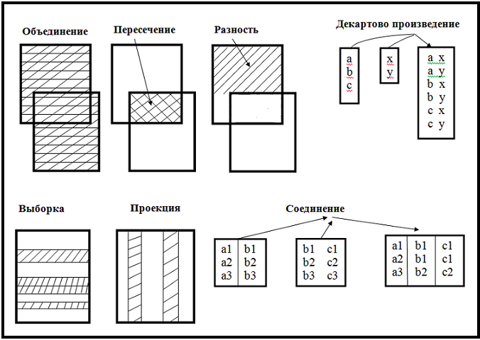
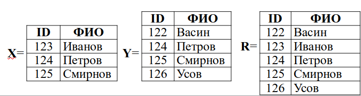
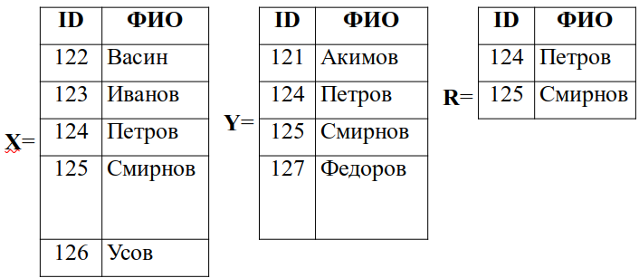
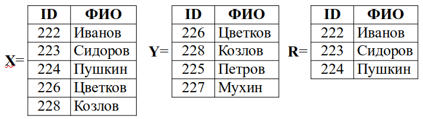
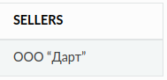

Базы данных
==============

Реляционные базы данных. Операции в реляционной алгебре
~~~~~~~~~~~~~~~~~~~~~~~~~~~~~~~~~~~~~~~~~~~~~~~~~~~~~~~~~

Реляционной базой данных называется совокупность отношений, содержащих всю информацию, которая должна храниться в базе.

*Реляционная алгебра* - замкнутая система операций над отношениями и их составляющими (атрибутами и их кортежами). Результат любой операции реляционной алгебры - новое отношение. Такие системы операций называются замкнутыми. Рассмотрим семь основных операций. Они разделены на две группы. 

Операции над любыми множествами:
 * Обьединение
 * Пересечение
 * Разность
 * Декартово произведение
 
Операции, применимые только к отношениями:
 * Выборка
 * Проэкция
 * Соединение

Для описания каждой операции приведем пример таблиц:

.. table:: таблица PRODUCTS (1.1)

    =====  =============  =========================   ==========
     ID       NAME               COMPANY                PRICE
    =====  =============  =========================   ==========
     123    Печеньки        ООО ”Темная сторона”          190
     156      Чай           ООО ”Темная сторона”          60
     235      Ананасы       ОАО ”Фрукты”                 100
     623      Томаты        ООО ”Овощи”                  130
    =====  =============  =========================   ==========

.. table:: Таблица DRIVERS (1.2)

    =========================   =============
            COMPANY                DRIVER
    =========================   =============
      ООО ”Темная сторона”          Владимир
      ООО ”Темная сторона”          Михаил
      ОАО ”Фрукты”                  Руслан
       ООО ”Овощи”                  Владимир
    =========================   =============

.. table:: Таблица Sellers (1.3)

    =====  ================
     ID        SELLERS   
    =====  ================
    123  	OOO “Дарт”
    156      ОАО ”Ведро” 
    235    ЗАО “Овоще База” 
    623     ОАО ”Фирма”
    =====  ================

Таблицы состоят из 4х строк, строка в таблице является **кортежем** в реляционной теории. Множество упорядоченных кортежей называется **отношением**.
Перед тем как дать определение отношения, введем еще один термин — **домен**. Домены применительно к таблице это столбцы

В отношении требованием является то, что все кортежи должны различаться. Для однозначной идентификации кортежа существует первичный ключ. Первичный ключ это атрибут или набор из минимального числа атрибутов, который однозначно идентифицирует конкретный кортеж и не содержит дополнительных атрибутов.
Подразумевается, что все атрибуты в первичном ключе должны быть необходимыми и достаточными для идентификации конкретного кортежа, и исключение любого из атрибутов в ключе сделает его недостаточным для идентификации. Например, в таблице (1.2) ключом будет сочетание атрибутов из первого и второго столбца

В реляционной БД таблицы взаимосвязаны и соотносятся друг с другом как главные и подчиненные. Связь главной и подчиненнной таблицы осуществляется через первичный ключ (primary key) главной таблицы и внешний ключ ( foreign key ) подчиненной таблицы.
Внешний ключ это атрибут или набор атрибутов, который в главной таблице является первичным ключем

Выборка
"""""""""

Выборка — это операция, которая выделяет **множество строк в таблице, удовлетворяющих заданным условиям**. Условием может быть любое логическое выражение.
Для примера сделаем выборку из таблицы с ценой больше 90.

:math:`σ_{(PRICE>90)} PRODUCTS`

    =====  =============  =========================   ==========
     ID       NAME               COMPANY                PRICE
    =====  =============  =========================   ==========
     123    Печеньки        ООО ”Темная сторона”         190
     235      Ананасы       ОАО ”Фрукты”                 100
     623      Томаты        ООО ”Овощи”                  130
    =====  =============  =========================   ==========

В условии выборки мы можем использовать любое логическое выражение. Сделаем еще одну выборку с ценой больше 90 и ID товара меньше 300:

:math:`σ_{(PRICE>90 \ \land \ ID<300)} PRODUCTS`

    =====  =============  =========================   ==========
     ID       NAME               COMPANY                PRICE
    =====  =============  =========================   ==========
     123    Печеньки        ООО ”Темная сторона”         190
     235      Ананасы       ОАО ”Фрукты”                 100
    =====  =============  =========================   ==========

Проекция
""""""""""

Проекция является операцией, при которой из отношения выделяются атрибуты только из указанных доментов, то есть **из таблицы выбираются тольно нужные столбцы**

Для примера сделаем проекцию на таблице PRODUCTS выбрав из нее ID и PRICE

:math:`π_{ (ID, PRICE) } PRODUCTS`

    =====  ================
     ID        PRICE
    =====  ================
    123  	    190
    156          60
    235         100
    623         130
    =====  ================

Совместим операторы проекции и выборки. Мы можем это сделать, потому что любой из операторов в результате возвращает отношение и в качестве аргументов использует также отношение.
Из таблицы с продуктами выберем все компании, продающие продуты дешевле 110.

:math:`π_{ COMPANY σ(PRICE<100 ) } PRODUCTS`

Соединение и естественное соединение
""""""""""""""""""""""""""""""""""""""

Операция соединения обратна операции проекции и создает новое отношение из двух уже существующих. **Новое отношение получается конкатенацией кортежей первого и второго отношений, при этом конкатенации подвергаются отношения, в которых совпадают значения заданных атрибутов**. В частности, если соединить отношения PRODUCTS и SELLERS, этими атрибутами будут атрибуты доменов ID.

Также для понятности можно представить соеднинение как результат двух операций. Сначала берется произведение исходных таблиц, а потом из полученного отношения мы делаем выборку с условием равенства атрибутов из одинаковых доменов. В данном случае условием явлется равенство PRODUCTS.ID и SELLERS.ID.

Попробуем соединить отношения PRODUCTS и SELLERS и получим отношение:

  ==============  =============  =========================   ==========  =============  ==============
   PRODUCTS.ID       NAME               COMPANY                PRICE      SELLERS.ID       SELLER
  ==============  =============  =========================   ==========  =============  ==============
     123            Печеньки        ООО ”Темная сторона”        190          123          OOO “Дарт”
     156             Чай            ООО ”Темная сторона”        60           156          ОАО ”Ведро”
     235            Ананасы           ОАО ”Фрукты”              100          235          ОАО ”Ведро”
     623             Томаты           ООО ”Овощи”               130          623          OOO “Дарт”
  ==============  =============  =========================   ==========  =============  ==============

**Естественное (натуральное)** соединение получает схожее отношение, но в случае, если у нас корректно настроена схема в базе ( в данном случае первичный ключ таблицы PRODUCTS ID связан с внешним ключем таблицы SELLERS ID), то в результирующем отношении остается один домен ID. То есть **каждый из общих столбцов остается в единственном экземпляре**

:math:`PRODUCTS ⋈ SELLERS`

  ==============  =============  =========================   ==========  ==============
   PRODUCTS.ID       NAME               COMPANY                PRICE         SELLERS
  ==============  =============  =========================   ==========  ==============
     123            Печеньки        ООО ”Темная сторона”        190        OOO “Дарт”
     156             Чай            ООО ”Темная сторона”        60         ОАО ”Ведро”
     235            Ананасы           ОАО ”Фрукты”              100        ОАО ”Ведро”
     623             Томаты           ООО ”Овощи”               130        OOO “Дарт”
  ==============  =============  =========================   ==========  ==============

Объединение
"""""""""""""

:math:`R = X \ \cup \ Y`

Результатом этой бинарной операции является таблица R, в которой каждая запись принадлежит либо таблице Х, либо таблице Y.
Таблицы Х и Y должны быть совместимыми:

 * **одинаковое число атрибутов**
 * **соответствующие атрибуты имеют одинаковый домен**

Пересечение
"""""""""""""

:math:`R = X \ \cap \ Y`

Результатом этой бинарной операции является таблица R, в которой каждая запись принадлежит как таблице Х, так и таблице Y
Таблицы Х и Y должны быть **совместимыми**

Удаление
""""""""""

Результатом этой бинарной операции является таблица R, в которой каждая запись принадлежит таблице Х, но не принадлежит таблице Y.
Таблицы Х и Y должны быть **совместимыми**

Декартово произведение
""""""""""""""""""""""""

Умножение или декартово произведение является операцией, производимой над двумя отношениями, в результате которой мы получаем **отношение со всеми доменами из двух начальных отношений**. Кортежи в этих доменах будут представлять из себя все возможные сочетания кортежей из начальных отношений

:math:`PRODUCTS × SELLERS`

  ==============  =============  =========================   ==========  =============  ==============
   PRODUCTS.ID       NAME               COMPANY                PRICE      SELLERS.ID       SELLER
  ==============  =============  =========================   ==========  =============  ==============
     123            Печеньки        ООО ”Темная сторона”        190          123          OOO “Дарт”
     156             Чай            ООО ”Темная сторона”        60           156          ОАО ”Ведро”
     235            Ананасы           ОАО ”Фрукты”              100          235          ОАО ”Ведро”
     623             Томаты           ООО ”Овощи”               130          623          OOO “Дарт”
  ==============  =============  =========================   ==========  =============  ==============

Для примера использования этой операции представим себе необходимость выбрать продавцов с ценами меньше 90. Без произведения необходимо было бы сначала получить ID продуктов из первой таблицы, потом по этим ID из второй таблицы получить нужные имена SELLER, а с использованием произведения будет такой запрос:

:math:`π_{ (SELLER) σ(PRODUCTS.ID=SELLERS.ID \ \land \ PRICE < 90) } PRODUCTS × SELLERS`

В результате этой операции получим отношение:

Установка MySQL
~~~~~~~~~~~~~~~~~~

.. code-block:: bash

  sudo apt install mysql-server mysql-client

   #проверка, запущена ли служба 
  sudo systemctl status mysql

  #заходим под root и создаем нового пользователя
  mysql -u root -p
  CREATE USER 'test_user'@'localhost' IDENTIFIED BY 'password';

  # Чтобы предоставить права суперпользователя
  GRANT ALL PRIVILEGES ON * . * TO 'test_user'@'localhost';

Основы MySQL
~~~~~~~~~~~~~~~

.. code-block:: sql

  mysql -u username -p /* вход в mysql под пользователем username */

  create database bank; /* создание базы данных */

  use bank; /* выбор базы данных */

Для работы потребуются тестовые данные. Скачать их можно `здесь <https://resources.oreilly.com/examples/9780596520847/blob/master/LearningSQLExample.sql>`_

.. code-block:: sql
  
  source path_to_example.sql /* загрузка данных */

Типы данных SQL
~~~~~~~~~~~~~~~~~

Используемая литература
~~~~~~~~~~~~~~~~~~~~~~~~~

`Alan Beaulieu "Learning SQL" <Alan_Beaulieu-Learning_SQL-RU.pdf>`_
